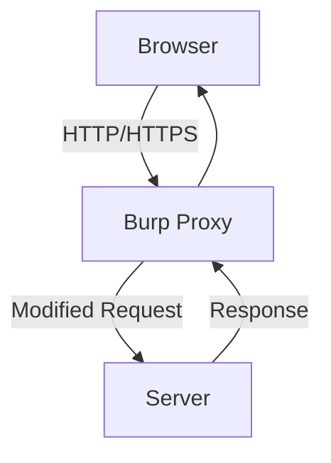
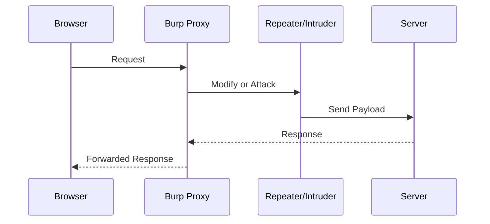

---

# 🛡️ Burp Suite Mastery Guide

A **complete guide** for **Burp Suite**, the most popular web application penetration testing tool.
Designed for **self-learning, bug bounty hunting, and pentesting practice**.

✨ This guide is **structured, visually aesthetic, and highly practical**, helping you **learn faster and retain knowledge**.

---

## 📖 Table of Contents

1. [What is Burp Suite?](#-what-is-burp-suite)
2. [Installation & Setup](#-installation--setup)
3. [Burp Suite Interface Overview](#-burp-suite-interface-overview)
4. [Key Features & Advantages](#-key-features--advantages)
5. [Core Tools Explained](#-core-tools-explained)
6. [Burp Suite Workflow (Step-by-Step)](#-burp-suite-workflow-step-by-step)
7. [Important Commands & Shortcuts](#-important-commands--shortcuts)
8. [Configuration & Settings](#-configuration--settings)
9. [Types of Attacks You Can Perform](#-types-of-attacks-you-can-perform)
10. [When, Where & How to Use Burp](#-when-where--how-to-use-burp)
11. [Best Practices & Tips](#-best-practices--tips)
12. [Mermaid Diagrams (Visual Learning)](#-mermaid-diagrams-visual-learning)
13. [Learning Resources](#-learning-resources)
14. [Conclusion](#-conclusion)

---

## ❓ What is Burp Suite?

**Burp Suite** is a **web security testing framework** by **PortSwigger**, used to **intercept, analyze, and manipulate** HTTP/HTTPS traffic.

💡 **Think of Burp as a “smart middleman” between your browser and the server.**

### 🔑 Use Cases:

* Detect **SQL Injection (SQLi), Cross-Site Scripting (XSS), and CSRF** vulnerabilities
* Test **authentication, session management, and cookies**
* Automate **fuzzing and brute force attacks**
* Perform **API security testing**

---

## 💻 Installation & Setup

### 🔹 1. Download Burp Suite

* Official site: [portswigger.net/burp](https://portswigger.net/burp)
* Versions:

  * **Community (Free)** → Great for learning
  * **Professional (Paid)** → Includes automated scanning & advanced features

### 🔹 2. Install Java (if required)

* Burp comes **bundled with Java**, but if missing, install **JRE 11+**

### 🔹 3. Configure Your Browser

1. Open Burp → `Proxy` tab → Ensure **Listener: 127.0.0.1:8080**
2. Set your browser’s proxy to:

   * **Host:** 127.0.0.1
   * **Port:** 8080
3. Import Burp’s **CA certificate** to intercept HTTPS traffic

✅ Tip: Use **Firefox** or a dedicated browser profile for security.

---

## 🖥️ Burp Suite Interface Overview

Burp Suite is divided into **intuitive tabs** for every task:

| Tab           | Purpose                                          |
| ------------- | ------------------------------------------------ |
| **Dashboard** | Overview of sessions, scan results, and history  |
| **Target**    | Define scope, organize site maps, view endpoints |
| **Proxy**     | Intercept, view, and modify requests/responses   |
| **Intruder**  | Automate attacks with payloads                   |
| **Repeater**  | Modify and resend requests manually              |
| **Sequencer** | Analyze randomness of session tokens             |
| **Decoder**   | Encode/Decode (Base64, URL, Hex, HTML)           |
| **Comparer**  | Compare requests/responses to spot differences   |
| **Extender**  | Install extensions from **BApp Store**           |

💡 **Visual Tip:** Think **Proxy → Repeater → Intruder → Scanner** as your main pentesting flow.

---

## ⭐ Key Features & Advantages

* **Intercept Traffic** → Inspect and modify requests in real-time
* **Define Scope** → Only test what matters
* **Manual + Automated Testing** → Flexibility for beginners & pros
* **Scanner (Pro)** → Automatic vulnerability detection
* **Plugin Support** → Extend with BApp Store extensions

---

## 🛠️ Core Tools Explained

### 🔹 Proxy

* Captures browser-server traffic
* Allows **editing requests before forwarding**
* Example: Modify **cookies, headers, or parameters**

### 🔹 Repeater

* Send **custom requests repeatedly**
* Test **parameter manipulation**
* Example: Change `id=1` → `id=2` and observe server response

### 🔹 Intruder

* Automates attacks with **payloads** (usernames, passwords, fuzz strings)
* Attack types:

  * **Sniper** → One variable at a time
  * **Battering Ram** → Same payload everywhere
  * **Pitchfork** → Parallel payloads
  * **Cluster Bomb** → All payload combinations

### 🔹 Scanner (Pro only)

* Finds vulnerabilities automatically, saves **manual effort**

### 🔹 Sequencer

* Tests randomness of session tokens for predictability

### 🔹 Decoder

* Convert between **Base64, Hex, URL encoding**, and more

### 🔹 Comparer

* Quickly spot differences between requests/responses

---

## ⌨️ Important Commands & Shortcuts

| Action                | Shortcut         |
| --------------------- | ---------------- |
| Forward request       | Ctrl + F         |
| Intercept On/Off      | Ctrl + T         |
| Send to Repeater      | Ctrl + R         |
| Send to Intruder      | Ctrl + I         |
| Send to Decoder       | Ctrl + U         |
| Send to Comparer      | Ctrl + Shift + C |
| Clear intercept queue | Ctrl + Shift + Q |

💡 Memorize these for **faster workflow**.

---

## ⚙️ Configuration & Settings

* **Proxy Listener:** Default `127.0.0.1:8080`
* **SSL Certificates:** Install CA cert in browser
* **Scope:** Limit to your target domains
* **Logging:** Enable full request/response history
* **User Options:** Hotkeys, themes, SSL behavior

💡 **Pro Tip:** Save your session as a **Burp Project File (.burp)** to continue later.

---

## 💣 Types of Attacks You Can Perform

* **SQL Injection** → Modify parameters (`id=1' OR '1'='1`)
* **XSS (Cross-Site Scripting)** → Inject ``
* **CSRF** → Send forged POST requests
* **Authentication Testing** → Brute-force login forms
* **Session Hijacking** → Modify cookies or tokens
* **API Security Testing** → Intercept & fuzz API endpoints

---

## 🕵️ When, Where & How to Use Burp

✅ **When:** Security testing, bug bounty hunting, red team exercises
✅ **Where:** Websites, APIs, login forms, session handling
✅ **How:** Intercept → Analyze → Modify → Exploit → Report

💡 Tip: Always **stick to legal targets** like labs and training platforms.

---

## 💡 Best Practices & Tips

* 🔒 Always **define scope** to avoid testing unrelated sites
* 🛑 Use **Intruder responsibly** → Avoid DoS attacks
* 🧑‍💻 Combine **manual + automated testing**
* 📑 Document **every finding** for reporting
* 🔄 Keep Burp updated & explore **BApp Store** extensions
* 🧪 Practice on **legal platforms**:

  * [PortSwigger Labs](https://portswigger.net/web-security)
  * [OWASP Juice Shop](https://owasp.org/www-project-juice-shop/)

---

## 🎨 Mermaid Diagrams (Visual Learning)

### Burp Suite Architecture

### Attack Process Flow

---

## 📚 Learning Resources

* 📘 [Burp Suite Academy](https://portswigger.net/web-security) → Free interactive labs
* 📖 [Official Documentation](https://portswigger.net/burp/documentation)
* 🎥 YouTube Channels: *Stök, LiveOverflow, InsiderPhD*
* 🏆 Bug bounty writeups: [HackerOne](https://hackerone.com), [Bugcrowd](https://bugcrowd.com)

---

## ✅ Conclusion

Burp Suite is the **Swiss Army Knife of web security testing**.
By mastering **Proxy, Repeater, and Intruder**, and practicing on **legal labs**, you can progress from **beginner → intermediate → advanced pentester**.

🚀 **Next Step:** Practice **daily**, explore **real-world applications**, and gradually incorporate **automated scanning & extensions** into your workflow.

---
