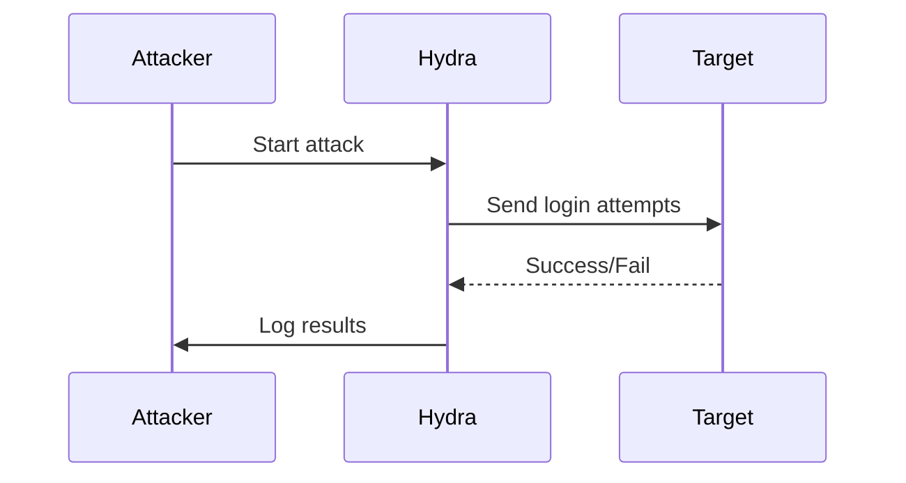
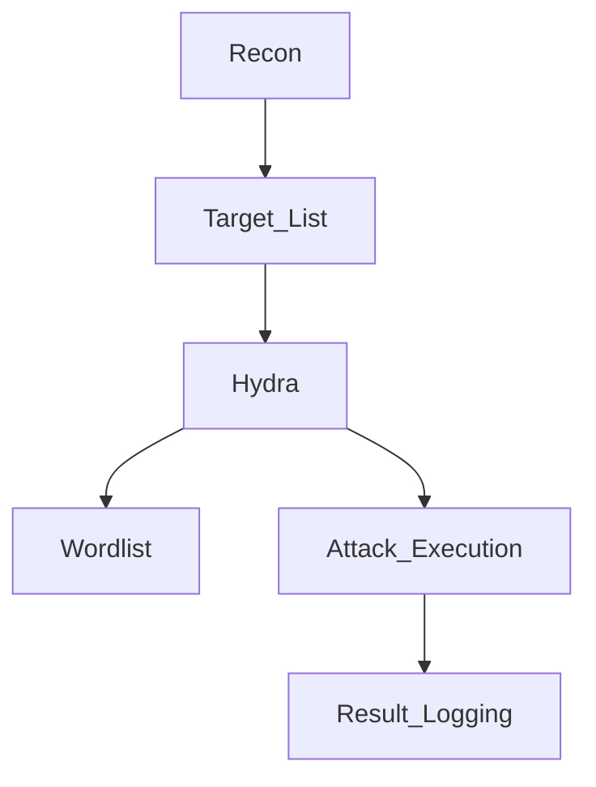
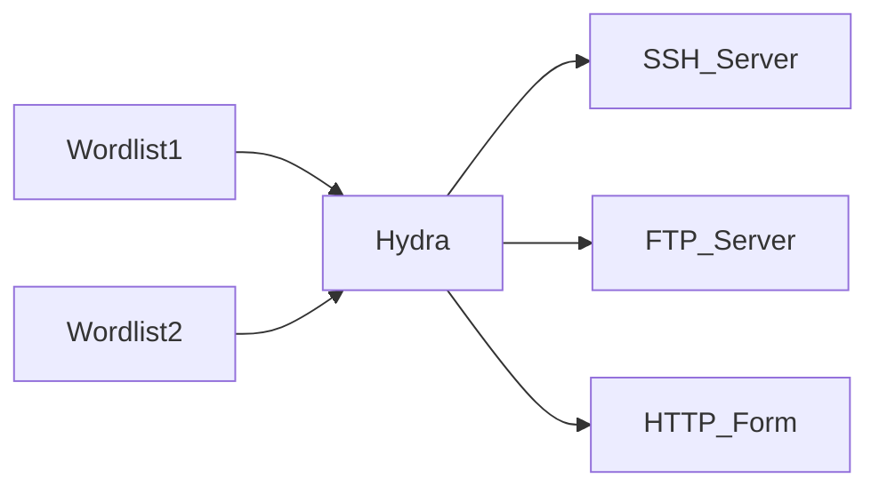

---

# 🐲 Hydra Guide

A **complete guide** for **Hydra**, the ultimate **password cracking and login brute-forcing tool**.
Perfect for **ethical hacking, penetration testing, and bug bounty practice**.

✨ Designed to be **easy to learn and highly practical**.

---

## 📖 Table of Contents

1. [What is Hydra?](#-what-is-hydra)
2. [Installation & Setup](#-installation--setup)
3. [Hydra Interface & Modes](#-hydra-interface--modes)
4. [Key Features & Advantages](#-key-features--advantages)
5. [Core Usage & Examples](#-core-usage--examples)
6. [Hydra Workflow (Step-by-Step)](#-hydra-workflow-step-by-step)
7. [Important Commands & Syntax](#-important-commands--syntax)
8. [Advanced Options & Configurations](#-advanced-options--configurations)
9. [Types of Attacks You Can Perform](#-types-of-attacks-you-can-perform)
10. [When, Where & How to Use Hydra](#-when-where--how-to-use-hydra)
11. [Best Practices & Tips](#-best-practices--tips)
12. [Mermaid Diagrams (Visual Learning)](#-mermaid-diagrams-visual-learning)
13. [Learning Resources](#-learning-resources)
14. [Conclusion](#-conclusion)

---

## ❓ What is Hydra?

**Hydra** (THC-Hydra) is a **fast, flexible, and multi-protocol password-cracking tool**.
It automates **dictionary and brute-force attacks** against **remote login services**.

💡 **Imagine Hydra as a super-smart “password tester” that works at lightning speed.**

### 🔑 Use Cases:

* Test **login security** on websites, servers, and network services
* Crack **SSH, FTP, Telnet, SMB, HTTP(S), RDP, MySQL, PostgreSQL, VNC**, and more
* Automate attacks using **wordlists or brute-force**
* Evaluate **password strength and user security practices**

---

## 💻 Installation & Setup

### 🔹 1. Linux (Kali, Ubuntu, Parrot)

```bash
sudo apt update
sudo apt install hydra hydra-gtk
```

### 🔹 2. Windows

* Install **Cygwin or WSL**
* Run Hydra via **CLI or GTK GUI**

### 🔹 3. macOS

```bash
brew install hydra
```

### 🔹 4. Verify Installation

```bash
hydra -h
```

You should see **Hydra’s help menu** with syntax and supported protocols.

💡 **Tip:** Use Hydra in a **dedicated terminal profile** to avoid clutter.

---

## 🖥️ Hydra Interface & Modes

| Mode                 | Description                     | Ideal For                       |
| -------------------- | ------------------------------- | ------------------------------- |
| **CLI**              | Full command-line control       | Advanced users, automation      |
| **GUI (Hydra GTK)**  | Graphical interface for attacks | Beginners, visual learners      |
| **Single Target**    | Attack one server/service       | Learning, small tests           |
| **Multiple Targets** | Attack multiple hosts           | Pentesting labs, network audits |

💡 **Visual Tip:** Use CLI for **scripting + large targets**, GTK for **quick tests**.

---

## ⭐ Key Features & Advantages

* **Supports 50+ protocols** including SSH, FTP, HTTP, Telnet, SMB, RDP, VNC
* **Parallelized attacks** → Faster results
* **Customizable wordlists & username/password combinations**
* **Service-specific login modules** → HTTP POST forms, FTP login, SSH
* **Verbose logging & output files** → Track attack progress
* **Integration with recon tools** → Nmap, Metasploit

---

## 🛠️ Core Usage & Examples

### 🔹 1. Basic Syntax

```bash
hydra -l <username> -P <password_list> <ip address> <service>
```

* `-l` → Single username
* `-L` → Username file
* `-p` → Single password
* `-P` → Password file
* `<ip address>` → Target IP or domain
* `<service>` → Protocol (ssh, ftp, http-get, etc.)

---

### 🔹 2. Practical Examples

**SSH Attack (Single User, Wordlist)**

```bash
hydra -l <username> -P <password_list> <ip address> ssh
```

**FTP Attack (Multiple Users)**

```bash
hydra -L <username_list> -P <password_list> ftp://<ip address>
```

**HTTP Form Attack (POST)**

```bash
hydra -L <username_list> -P <password_list> <ip address> http-post-form "<login_path>:user=^USER^&pass=^PASS^:F=<failure_message>"
```

**Verbose Mode with Output File**

```bash
hydra -L <username_list> -P <password_list> <ip address> <service> -V -o <output_file>
```

💡 `^USER^` and `^PASS^` are **Hydra placeholders** replaced by each username/password combination.
`<login_path>` is the form action URL, `<failure_message>` is the text that appears on failed login.

---

## ⌨️ Important Commands & Syntax

| Command         | Description                                       |
| --------------- | ------------------------------------------------- |
| `-l <username>` | Single username                                   |
| `-L <userfile>` | File with usernames                               |
| `-p <password>` | Single password                                   |
| `-P <passfile>` | File with passwords                               |
| `-s <port>`     | Specify custom port (default depends on service)  |
| `-t <tasks>`    | Number of parallel threads                        |
| `-V`            | Verbose, shows attempts                           |
| `-f`            | Stop after first valid login                      |
| `-o <file>`     | Save results to file                              |
| `-e <options>`  | Password testing options (ns = null/empty + same) |
| `-w`            | Wait/timeout per attempt                          |
| `-I`            | Ignore SSL certificate errors                     |

💡 **Pro Tip:** Start small, test syntax, then scale to multiple targets.

---

## ⚙️ Advanced Options & Configurations

* **Parallel connections:** `-t <number>` for faster attacks
* **Timeout & retries:** `-w <seconds>` and `-R <retry_count>`
* **Custom HTTP headers:** Useful for web forms behind WAFs
* **Proxy support:** Route via Tor or VPN: `<proxy:port>`
* **SSL bypass:** `-I` ignores invalid certificates
* **Hydra modules:** Each protocol has **specific options** (SSH, FTP, HTTP POST, MSSQL, etc.)
* **Output formats:** Save as `.txt`, `.csv`, or `.json` for reporting and analysis
* **Integration:** Combine with **Metasploit, Nmap, or Python scripts** for automated pentesting

---

## 💣 Types of Attacks You Can Perform

* **SSH/Telnet:** Server remote logins
* **FTP/SMB:** File server logins
* **HTTP Login Forms:** Websites with GET/POST forms
* **Database:** MySQL, MSSQL, PostgreSQL, Oracle
* **Email Servers:** SMTP, POP3, IMAP
* **Remote Desktop (RDP/VNC)**
* **Multi-protocol attacks:** Hydra supports scripting attacks on multiple protocols simultaneously

💡 Hydra is **versatile but always use on legal, authorized targets**.

---

## 🕵️ When, Where & How to Use Hydra

✅ **When:** Security audits, pentesting, password testing
✅ **Where:** Servers, web apps, remote services, database logins
✅ **How:** Recon → Gather usernames/passwords → Select protocol → Execute attack → Analyze results

💡 **Visual workflow:** Think **Recon → Wordlists → Hydra → Results → Reporting**

---

## 💡 Best Practices & Tips

* 🔒 Only **attack authorized targets**
* 🧑‍💻 Combine with **recon tools** like Nmap, Nikto, and Gobuster
* 📑 Keep **logs and reports** of every attack
* 🔄 Customize wordlists for **better success rates**
* ⚡ Start small, increase threads gradually
* 🧪 Practice on labs: HackTheBox, VulnHub, TryHackMe
* ⚙️ Always test **protocol-specific options** for more effective attacks
* 💡 Use **verbose and output options** to learn and document attacks

---

## 🎨 Mermaid Diagrams (Visual Learning)

### Hydra Attack Flow



### Hydra Workflow Overview



### Advanced Parallel Attack Concept



---

## 📚 Learning Resources

* 📘 [THC-Hydra GitHub](https://github.com/vanhauser-thc/thc-hydra) → Official source
* 📖 [Kali Linux Documentation](https://www.kali.org/tools/hydra/)
* 🎥 YouTube Channels: Hackersploit, IppSec, NetworkChuck
* 🏆 Labs: [HackTheBox](https://www.hackthebox.eu), [VulnHub](https://www.vulnhub.com), [TryHackMe](https://tryhackme.com)

---

## ✅ Conclusion

Hydra is a **powerful, fast, and versatile tool** for testing login security.
Mastering **wordlists, syntax, service modules, parallel attacks, and advanced options** will take you from **beginner → advanced pentester**.

🚀 **Next Step:** Practice on **lab environments**, create **custom wordlists**, combine with **recon tools**, and gradually tackle **realistic pentesting scenarios**.

---
